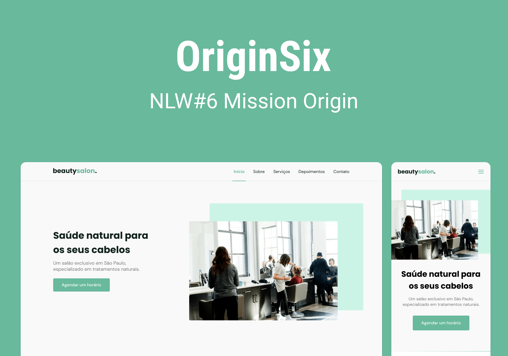

  <a href="#-tecnologias">Tecnologias</a>&nbsp;&nbsp;&nbsp;|&nbsp;&nbsp;&nbsp;
  <a href="#-projeto">Projeto</a>&nbsp;&nbsp;&nbsp;|&nbsp;&nbsp;&nbsp;
  <a href="#memo-licença">Licença</a>

  

 

  

## 🚀 Tecnologias

Esse projeto foi desenvolvido com as seguintes tecnologias:

- HTML
- CSS
- JavaScript

Bibliotecas

- [Google Fonts](https://fonts.google.com/)
- [SwiperJS](https://github.com/nolimits4web/Swiper)
- [ScrollRevel](https://scrollrevealjs.org)

Utilitários

- [randomuser.me](https://randomuser.me/photos)
- [IconMoon](https://icomoon.io/app/#/select)

## 💻 Projeto

OriginSix é uma página institucional no formato One Page, responsiva, para usar em diversos tipos de micro, pequena e média empresas. Contém as seguintes seções: Header, Navigation, Home, Sobre, Serviços, Depoimentos, Contato e Footer.

Você pode acessar <a href="https://marisasales.github.io/Origin-Six/" target="_blank"><b>clicando aqui</b></a>.

## 📝 Licença

Esse projeto está sob a licença MIT. Veja o arquivo [LICENSE](.github/LICENSE.md) para mais detalhes.

------

> Desenvolvido com ❤️ durante a #NextLevelWeekTogether da **[Rocketseat 💜🚀](https://rocketseat.com.br/)** 

------

